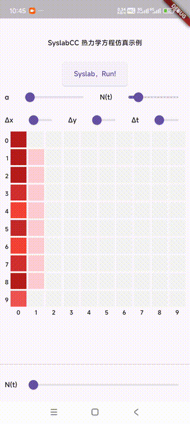

# Julia Android Example

<!-- load static/output.gif and center it -->
<center>
    
</center>

You can also download the APK releases from the release page.

## Build the Standalone C++ Project

P.S: You don't need to build it again as I placed the built files in `native/libheat`.

In order to proceed the code generation, this you will need [SyslabCC](https://www.tongyuan.cc/Download) which is a Julia AOT compiler bundled in MWORKS.Syslab.

```bash
> scc build.jl -o libheat.dll --no-blas

> ls .syslabcc-cache/libheat/
atomic_ops  bin             juliamk.jl  libheat.cpp  make.jl   syslabcrt-dylib       syslabcrt-io
bdwgc       ghc-filesystem  lib         libheat.h    Makefile  syslabcrt-intrinsics  win32-implib
```

Then you copy contents in `.syslabcc-cache/libheat/` into `native/libheat`.

## Build the Flutter Project

You need to have an Android mobile device to run the app.

This project also shall build on Linux x64/aarch64, but it might not build on Windows as SyslabCC released on 2024/06 does not support MSVC (The recent one has supported Window/macOS build but it is not yet available publicly).

```bash
flutter run
# flutter run -d <your android phone device id>
```

For more details, see [Debug Flutter apps](https://docs.flutter.dev/testing/debugging).


## Patches

We uses Rust to build the Julia-generated C++ project and integrate them into Flutter.

However, the generated library requires `libc++_shared.so` on Android. I use patches from [this](https://github.com/Losses/rune/pull/26):

1. Modifying `android/app/build.gradle` according to [commit aa78bf1
](https://github.com/Losses/rune/commit/aa78bf17b3e73284a97165cdbf79c65c30dcc11b)

2. Addint the following lines to `native/hub/build.rs`:

    ```rust
    let target_os = std::env::var("CARGO_CFG_TARGET_OS");
    match target_os.as_ref().map(|x| &**x) {
        Ok("android") => {
            println!("cargo:rustc-link-lib=dylib=stdc++");
            println!("cargo:rustc-link-lib=c++_shared");
        },
        _ => {}
    }
    ```